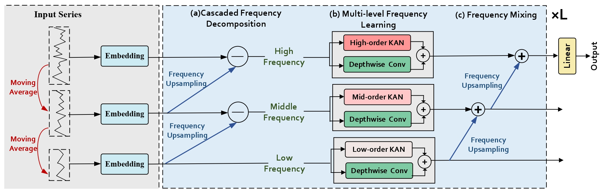
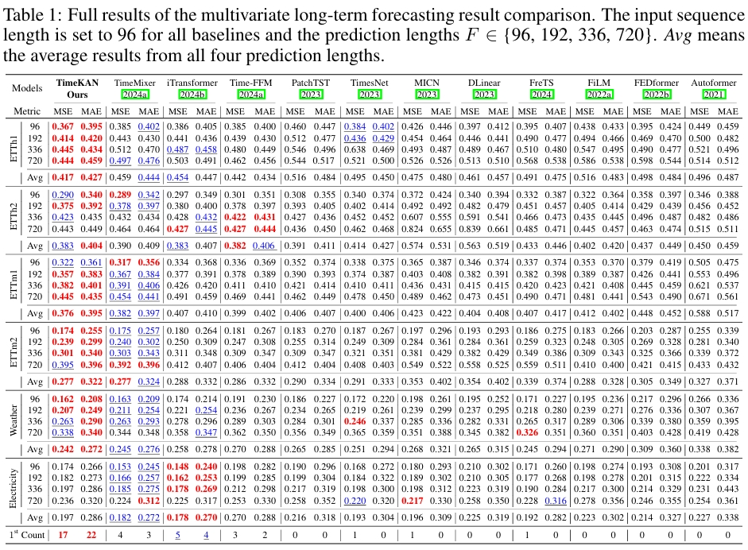

<div align="center">
  <h2><b> (ICLR 2025) TimeKAN: KAN-based Frequency Decomposition Learning Architecture for Long-term Time Series Forecasting🚀 </b></h2>
</div>

### This is an offical implementation of "TimeKAN: KAN-based Frequency Decomposition Learning Architecture for Long-term Time Series Forecasting" 

## Overall Architecture
<p align="center">

</p>


## Results
<p align="center">

</p>

## Getting Started
1. Install requirements. ```pip install -r requirements.txt```

2. Download data. You can download all the datasets from [Autoformer](https://drive.google.com/drive/folders/1ZOYpTUa82_jCcxIdTmyr0LXQfvaM9vIy). 

3. Training. All the scripts are in the directory ```.scripts```.  If you want to obtain the results of **input-96-predict-96** on the Weather dataset, you can run the following command:
```
sh scripts/long_term_forecast/Weather/weather_96.sh
```


## Battery Dataset Placement (Custom)
- Put battery files under `./dataset/battery/` (not under `./data_provider/`).
- Recommended filenames:
  - `battery_36Ah_70W_65W_1551.xlsx`
  - `battery_30Ah_1C_1C_2800.xlsx`
- Use the following arguments for training:
  - `--root_path ./dataset/battery/`
  - `--data_path battery_36Ah_70W_65W_1551.xlsx`


## Windows Quick Start (Battery SOH)
- This repository pipeline is now streamlined for `battery_soh` forecasting only (MKAN/TimeKAN + SOH).
- Recommended Python: **3.10** (PyTorch 1.13.1 is more stable on Windows with 3.10 than 3.12).
- Create environment and install:
```bash
python -m venv .venv
.venv\Scripts\activate
pip install --upgrade pip
pip install -r requirements.txt
```
- Run battery SOH script on Windows CMD:
```bat
cd TimeKAN-main
scripts\Battery\soh_20_1.bat
```
- Or run `run.py` directly in PyCharm (without parameters) after setting Working Directory to `TimeKAN-main`; it will auto-load battery SOH quickstart defaults.
- If your machine has no GPU, add `--use_gpu False` to the command in `.bat`.
- After testing, results now also include:
  - `results/<setting>/prediction_vs_truth.png` (overall prediction curve visualization)
  - `results/<setting>/prediction_vs_truth.csv` (true/pred pairs)
  - `r2` printed in console and saved into `metrics.npy`.
- Troubleshooting: if you see `argparse.ArgumentError: ... conflicting option string: --task_name`, you are likely running an older duplicated `run.py`; update/sync `TimeKAN-main/run.py` and ensure PyCharm uses this file as Script path.


### Battery file format expected by the SOH loader
- Column 1: cycle index (for reference).
- Column 4: SOH value (already precomputed by you).
- The loader now reads SOH directly from column 4 and does not recompute SOH from capacity.

### Train/Val/Test split arguments
- You can control split ratios directly in `run.py` arguments:
  - `--train_ratio` (default `0.7`)
  - `--val_ratio` (default `0.1`)
  - test ratio is `1 - train_ratio - val_ratio`

## Acknowledgement

We sincerely appreciate the following github repo very much for the valuable code base and datasets:

https://github.com/cure-lab/LTSF-Linear

https://github.com/kwuking/TimeMixer

https://github.com/thuml/Time-Series-Library

https://github.com/ts-kim/RevIN

https://github.com/SynodicMonth/ChebyKAN


## Citation

If you find this repository useful for your work, please consider citing it as follows:

```BibTeX
@inproceedings{
  huang2025timekan,
  title={Time{KAN}: {KAN}-based Frequency Decomposition Learning Architecture for Long-term Time Series Forecasting},
  author={Songtao Huang and Zhen Zhao and Can Li and LEI BAI},
  booktitle={The Thirteenth International Conference on Learning Representations},
  year={2025},
  url={https://openreview.net/forum?id=wTLc79YNbh}
}
```
